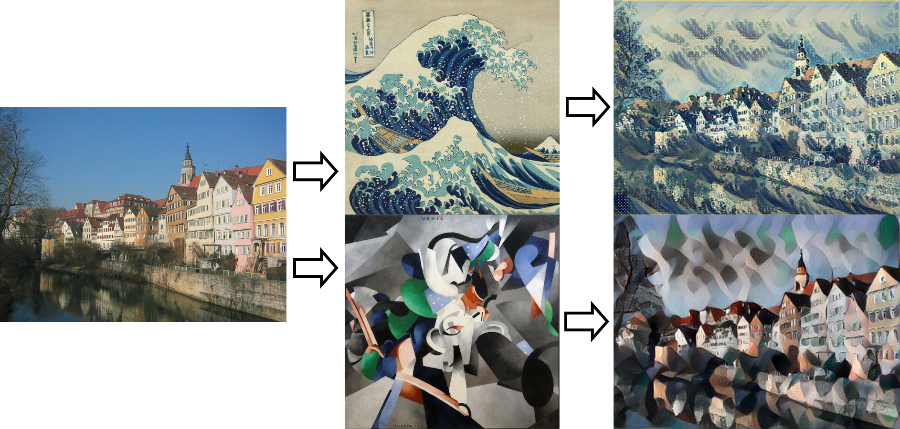

    <b>Author: Yufei Wang (@ywang2395)</b>

# Links

- **Access the slides**: [link to the slides](https://docs.google.com/presentation/d/1qLdWadoXrZWaJOqq9FU_4ukQw1xilTGpzmw6F1m6F78/edit?usp=sharing)
- **Access the presentation video**: [link to the video](https://drive.google.com/file/d/1P2sJ0v2ztzx-D9d6QAXj3R9ias3AMnfw/view?usp=sharing)
- **Access the proposal**: [link to the proposal](https://docs.google.com/document/d/12z7viYohrQLRn2h_9MDv4iU1bkD_dF7SC7pGuQTBSq4/edit?usp=sharing)
- **Access the mid-term report**: [link to the report](https://drive.google.com/file/d/1NJ5oxno6_64puAJ-z8V15Dvs0C5-Bbp_/view?usp=sharing)
- **Access the code**: [link to the code](https://github.com/overflocat/Object-Detection-and-Image-Processing-for-Visual-Content-Creation)
- **Access the pre-trained model**: [link to the model](https://drive.google.com/file/d/1Jf3UOZI99mcA3DmnAAshPw4aLueW17EL/view?usp=sharing)
- **Access the fine-tuned model**: [link to the model](https://drive.google.com/file/d/15rOVWoFBWfbKd8PuP1ASsdjJup063PVp/view?usp=sharing)

For more information about the link provided here, see the *Work Distribution* and *Code Source Declaration* part at the end of the report.

# Introduction

Applying filters on a certain kind of recurring objects is a common need in visual content creation. For instance, the image on the left side in the figure below applied color splash filter on balloons, in which all content are turned into grayscale except the balloons; and the image on the right side is clipped from a TV show, in which the passerby is blurred to protect his privacy. In both of these situations, visual content creators need to identify recurring objects when they deal with large amount of images, and apply filters on these specified objects.

  

However, identifying recurring objects on large amount of images is tedious. If we could make an algorithm to automatically identify the objects and apply image processing methods on them, visual content creators could be freed from repetitive work and focus more on the creations process. To solve the problem, we could roughly divide it into three different stages: Detecting the object and classify it, find the segmentation mask of the object, and do the image processing on the specified parts. The figure below illustrates the process.

  

## Object Detection

The problem definition of object detection is to determine where the object is located in a given image, and which category the object belongs to. Or in other words, it also consists of two parts: object localization, and object classification. The location of an object is usually represented by its bounding box, which is a rectangle boundary of the object in the given image. Nowadays, a lot of deep learning frameworks have been developed for dealing with object detection problems. For instance, YOLO is a real time object detection algorithm, which could find the location of all objects in an image and classify them in just one pass. Other frameworks like Mask R-CNN could not only detect the object, but also find its semantic segmentation by giving its pixel-level mask. For solving our problem, we not only need to classify the object, but also need to get the segmentation mask of the object, so we choose Mask R-CNN as the backbone for object detection and mask generation. A detailed explanation of Mask R-CNN could be found in the next section.

## Image Processing

After we find the object in the images, we could do some image processing on the desired area by referring to the segmentation mask of the objects. Some rough ideas could be easily thought out, like blurring the detected parts - this is a common need when processing videos, for instance, in some situations we want to blur all human faces or license plate in the video. Some other image processing methods could also be applied, like the color splash filter we have mentioned above, pixelation, or even the style transfer proposed by Gatys et al. Applying image processing methods seems easy, but it could also be challenging, as we only want to apply it on desired parts of the image, and the processed part should also be consistent with the whole image. I will introduce more about this part in details in the next section.

# Method

## Mask R-CNN

Mask R-CNN is actually a framework for object instance segmentation. It extends Faster R-CNN, by adding a branch for predicting an object mask, in parallel with the existing branch for bounding box prediction. The mask could be easily trained for instance segmentation, and it could also be used for other tasks such as human pose detection. The structure of Mask R-CNN is illustrated below.

  

Mask R-CNN is roughly consisted of three parts: the Region Proposal Network (RPN), the bounding box regression and classification branch, and the mask generator branch, which are briefly explained below:

- RPN proposes Regions of Interests (ROI) from the feature maps output by the convolutional network. The convolutional neural network used in RPN, often called a backbone, us usually a pre-trained deep convolutional neural network for image classification, like ResNet-101 or VGG. Their last few fully connected layers for classification will be removed and only the result of feature maps will be used. With the result of feature maps and pre-defined anchor boxes, RPN will generate proposals of Regions of Interest (ROIs). These ROIs will be fed into the next stage.
- The bounding box regression and classification branch will generate the classification for object in each bounding box, and generate the exact location of the bounding box. The ROI proposed by the RPN will be converted into fixed sizes using ROI Pooling (in Faster R-CNN) or ROI Align (In Mask R-CNN), and then passed through several convolutional layers and fully connected layers to generate the bounding box location and the classification result with the help of SoftMax.
- The mask prediction branch  is newly added in Mask R-CNN, and that is the key reason why I choose the framework. It predicts a binary mask of each ROIs using two extra convolutional layers, which could be converted back to a pixel-level mask on the original image to provide information about instance segmentation.

## Fine Tuning

Pre-trained models of Mask R-CNN could be easily found on the Internet, and these models are usually trained on a relatively large dataset, like COCO. However, if we directly apply those pre-trained model on user-specified images, it may lead to some problems. For instance, the Mask R-CNN model per-trained on COCO dataset would regard UW-Madison logo as a stop sign, which is illustrated below.

  

In conclusion, using pre-trained model will possibly cause some problems below:

- Misclassify objects into unnecessary categories, which could be removed
- Low accuracy on the needed categories, which could be improved
- Some needed categories may not be included in the pre-trained models, for instance, the balloons

To solve the problems above, the pre-trained model needs to be find-tuned on the user-specified dataset. When fine-tuning the model, the whole model will be initialized with the weights from the pre-trained model, but the final classification layer will be removed and new classification layers with specified number of neurons (which is corresponding to the number of classes in the user-specified dataset) are attached. Then the new model will be continued training on the new dataset. With the knowledge learned in the pre-trained model, the new model will converge faster on the new dataset.

To find-tune Mask R-CNN, I followed a cascaded process: Firstly only the RPN, the bounding box regression and classification branch, and the mask generator branch will be tuned, and all variables in the backbone network will be froze. Next, some layers in the backbone network will be freed and also be tuned. It is like a cascaded process of several stages and this could provide better performance in practice.

## Image Processing Methods

I apply four different kinds of image processing methods: color splash, blurring, pixelation and style-transfer. Color splash, blurring and pixelation will commonly be regarded as *traditional* methods, while style-transfer is also a technique utilize neural network. I will introduce them respectively in the following sections.

### Color Splash, Pixelation and Blurring

Examples of each of these three effects are illustrated below. Color Splash is a image filter, after applying it only the specified object is kept in color; For pixelation the object will be pixelated; and for blurring the object will be blurred.

  

Implementing Color Splash filter is straight-forward. Firstly the whole image will be turned into the gray scale, and then the image will be merged with the  original image based on the object segmentation mask. For Pixelation and Blurring I follow the same idea - Firstly apply the image processing method on the whole image, then merge the processed image with the original image based on the object segmentation mask. For pixelation, I simply slide a rectangle window on the image, and replace all pixels in the window with the mean value of them. For blurring the image I apply median filter on the original image to get the blurred image.

### Style Transfer

Style Transfer is a technique proposed by Gatys et al. at 2015. In paper *A neural algorithm of artistic style* they proposed new metrices to compare the "style distance" and the "content distance" from the original image to the target image. An example of image style transferring is illustrated below.

  

At the left side, it is the original image; and in the middle there are two style images. If we regard the style distance and the content distance as the loss, and optimize to get a new image which minimize the style distance with the style image and the content distance with the content image, an new image could be got. The new image will keep the content in the original image, while the style will be similar to the style image. At the right side there are two images generated by the style transfer algorithm.

How do they define the style loss and the content loss? The content distance is straight forward - they define the content loss to be the squared L2 distance between two feature maps, which could be got from a per-trained deep neural network like VGG. The content distance (or the loss) is defined as the formula above. For the style loss, things are a little bit complicated: they firstly compute the correlation between two different feature maps in the same layer, and use the result to construct a correlation matrix G, which is defined below. Then, they compute the squared l2 distance from the correlation matrix G of the style image to the correlation matrix G of the original image, and normalize the result to make sure it keeps the same scale with the content distance.

  

For generating the final image, in the original paper they start from a random noise image, and optimize the content loss and the style loss to get the final result. However, the whole process is really slow and may take several seconds to get a new image, which is acceptable when processing large amount of images or the video.

To solve the problems above, I follow the instructions in *Perceptual losses for real-time style transfer and super-resolution*, to build a fast neural style transfer network. The network contains several convolution and transpose convolution layers, which is trained on COCO and try to minimize the style loss of every image in the training set with the target style image, while keeping the content of the image unchanged. After training, the network will be able to change the style of any input image to the target style, within one second of running time.

## Image Mixing

As described above, for applying image processing methods on specified objects in the image, an easy idea is to firstly apply the image processing method on the whole image, and then use the object segmentation mask to merge two images. However, directly using the mask to mix two images will lead to hard edge on the edge of the mask, especially for the case when the processed image is not similar to the original image. An example is illustrated below.

  

We have met this situation in hw3. However, as the mask of the two images do not overlap with each other (the mask of the two images are actually complementary), the method we used in hw3 could not be applied here. Instead, I found a simple method which could smooth the edge: firstly the mask will be converted to an binary image, in which 1 will be mapped to 255 and 0 will be mapped to 0. Then, gaussian blur filter will be applied on the **mask**, and the blurred mask will be used to mix these two images. An example is illustrated below, in which the final mixed image does not have clear edges.

  

## From Images to Video

Visual content creators sometimes may need to process videos. For instance, a TV show provider may need to blur all passersby in the video. We already introduced methods above to apply filters on images, so it seems straight-forward to apply the same method on videos: video is just a sequence of image, so we just need to apply the object detection and image processing methods for each frame.

However, the result provided by Mask R-CNN is not robust, and sometimes the mask generated for one frame will be totally different from the last frame. Here is an example, in which you could see that the mask of the object is flashing in the video.

  

To solve this problem, I created a pixel-level stabilizer for stabilizing the masks in a video. An example of the working process of the stabilizer is illustrated below.

  

The stabilizer works by majority voting. For the example at the top, even the first pixel is true on frame 0, its adjacent frames do not have supporting results. Therefore in the stabilized result, the true pixel will be ignored. For the example at the bottom, the first pixel is true on frame 0, and its adjacent frames do have this corresponding true pixel. Therefore in the final result, the first pixel is also true.

The stabilizer is not suitable for fast changing videos, so it could be disabled in the program for handling that case. In most of the cases it could improve the results of the video, and further results are included in the next section.

# Results

## Model Fine Tuning

For fine-tuning the model, I set up running environment on a Google Cloud machine with a Nvidia K80 Graphics card included. I still use the COCO dataset for training, but this time I only use the image with person class included, and only train the model on the person class. As I specified to fine-tune some layers in the backbone network ResNet-101, it takes around 50 hours to finish and costs me $30. The fine tuned model removed unnecessary categories, and does improve the mask accuracy on person class. An example is illustrated below.

  

On the left side is the result from the per-trained model, in which the hand of the girl is not included in the mask. On the right side is the result from fine-tuned model, in which the mask is much more accurate.

## Final Result

I applied the model trained only on person class, with video stabilizer enabled and smooth image mixer enabled, to generate some sample results for each image processing methods. The original video is illustrated below, which is clipped from the video in https://grad.wisc.edu/apply/.

  

The result of applying **Color Splash** filter is illustrated below.

  

The result of applying **pixelation** filter is illustrated below.

  

The result of applying **blurring** filter is illustrated below.

  

The result of applying style transfer filter is illustrated below. The style image used for training the network could be obtained at [wiki.com](https://en.wikipedia.org/wiki/File:Francis_Picabia,_1913,_Udnie_(Young_American_Girl,_The_Dance),_oil_on_canvas,_290_x_300_cm,_Mus%C3%A9e_National_d%E2%80%99Art_Moderne,_Centre_Georges_Pompidou,_Paris..jpg), and the filter is only applied on the background.

  

# Problems, Analysis and Future Work

The result above looks great. However, there are still several problems which could be improved:

- Mask R-CNN is slow. Although it takes less than one second to process an image, it still needs one hour or more time to render an video within several minutes. As we fed the frames to the network one by one, it is somehow reasonable as there are usually 30 frames or 60 frames in a second for a video stream. However, there are some other frameworks for object detection which could run real-time. For instance, Poly-YOLO proposed by P Hurtik is a new framework, which is developed based on YOLOv3, and is able to perform object detection tasks and instance segmentation tasks real time. It could run more than 20 fps on a video stream, which is 50x faster then the Mask R-CNN model. 
- The style transfer itself is not stable to videos. Fast style-transfer network could generate visually different results for two really similar frames, so part of the video may flashing when applying the style-transfer filter. This problem could also be somehow solve by the video stabilizer by averaging the results between frames, or some more advanced techniques could be applied, for instance, the Video Style Transfer proposed by Manuel Ruder.
- The video stabilizer could still be tuned. For instance, in fast changing videos the video stabilizer should be disabled, so we could find some metrics to define the distance between two adjacent frames, and only enable the video stabilizer when the distance between these two frames are close enough. Another idea is to use Interaction over Union (IoU) to stabilizer the masks: If the IoU between two masks is high enough, then these two masks could be somehow averaged, otherwise the stabilizer should verify the result.

And there are some future work could be done:

- Add more filters. There are still a lot of image processing techniques could be applied!
- Add more categories for object detection, for instance, the car license plate or the human face, which are really useful in visual content creation.
- Allow users to specify the objects. Rather than simply block a category of objects in the video, we may create some user interface to allow user select some type of objects in a frame, and then apply and tracking the objects according to users' choice.

I will possibly dig into some of these as when I have free time, as it is a really interesting project and I will keep working on it.

Thanks again for reading my report!

# Code Source Declaration

- The code of Mask R-CNN is from https://github.com/matterport/Mask_RCNN. I modify some of the code to make it compatible with the project.
- The code of image mixing is from https://note.nkmk.me/en/python-pillow-composite/.

The rest parts of the code is basically implemented by me, including the fast style transfer code. I also referred to some pages on Stack OverFlow when I work on my implementation.

# Work Distribution

At the beginning of the semester, I am working with **Emma Liu (@liu763)**. The *Problem Statement* section and *Why is the Problem Important* section in the **proposal** are written by her, and she helped me fix some grammar mistakes in the mid-term report. The rest of the project, including the code, all the results, the final presentation slides and the video, the mid-term report and the webpage is completely done by me **independently**.

We splitted our work at the beginning of the semester: I will work on the Mask R-CNN part and she will work on YOLO. As there is a pandemic and everything is moved online, it is not easy to sync up with each other. She will possibly include more information about YOLO, to solve the first problem I have mentioned before. Please refer to her page for more information.

# References

- Zhao, Zhong-Qiu, et al. "Object detection with deep learning: A review." *IEEE transactions on neural networks and learning systems* 30.11 (2019): 3212-3232.
- Redmon, Joseph, et al. "You only look once: Unified, real-time object detection." *Proceedings of the IEEE conference on computer vision and pattern recognition*. 2016.
- He, Kaiming, et al. "Mask r-cnn." *Proceedings of the IEEE international conference on computer vision*. 2017.
- Gatys, Leon A., Alexander S. Ecker, and Matthias Bethge. "A neural algorithm of artistic style." *arXiv preprint arXiv:1508.06576* (2015).
- He, Kaiming, et al. "Mask r-cnn." *Proceedings of the IEEE international conference on computer vision*. 2017.
- He, Kaiming, et al. "Deep residual learning for image recognition." *Proceedings of the IEEE conference on computer vision and pattern recognition*. 2016.
- Simonyan, Karen, and Andrew Zisserman. "Very deep convolutional networks for large-scale image recognition." *arXiv preprint arXiv:1409.1556* (2014).
- Lin, Tsung-Yi, et al. "Microsoft coco: Common objects in context." *European conference on computer vision*. Springer, Cham, 2014.
- Johnson, Justin, Alexandre Alahi, and Li Fei-Fei. "Perceptual losses for real-time style transfer and super-resolution." *European conference on computer vision*. Springer, Cham, 2016.
- Hurtik, Petr, et al. "Poly-YOLO: higher speed, more precise detection and instance segmentation for YOLOv3." *arXiv preprint arXiv:2005.13243* (2020).
- Ruder, Manuel, Alexey Dosovitskiy, and Thomas Brox. "Artistic style transfer for videos." *German Conference on Pattern Recognition*. Springer, Cham, 2016.
